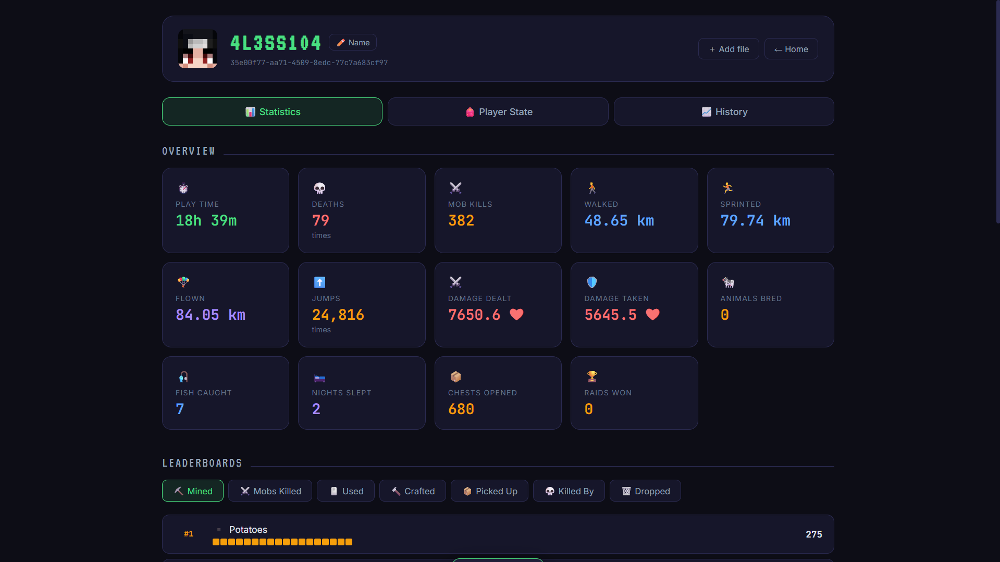

# ⛏ MCStats Viewer

> A zero-dependency dashboard to explore your Minecraft player **statistics**, **live state** (inventory, health, position…), and track **progress over time** — with optional **live auto-import** from a running server.

<p align="center">
  
  
  
  
  
  
</p>

---



---

## ✨ Features

The app has **three sections**:

### 📊 Statistics
- Overview cards: playtime, deaths, mob kills, distance (walking / running / flying), jumps, damage dealt & taken, animals bred, fish caught, nights slept, and more
- Ranked leaderboards with pixel-style bars: mined blocks, killed mobs, used / crafted / picked-up / dropped items, and "killed by"
- Real Minecraft item textures (with emoji fallback)

### 🎒 Player State
Reads the binary player data file and shows:
- ❤️ **Health** as Minecraft hearts (half-hearts supported) and 🍖 **Hunger** as drumsticks
- ✨ **Experience** bar with level and total XP
- 🎮 **Game mode** (Survival / Creative / Adventure / Spectator)
- 📍 **Positions** — current, last death, and respawn point, each with its dimension
- 🎒 **Full inventory** in Minecraft-style slots: armor, off-hand, hotbar, main inventory
- 📦 **Ender chest** contents and clickable **shulker boxes** (click to see what's inside)
- ✦ Enchanted items highlighted, with **enchantments shown on hover** (name + level)

### 📈 History
- Snapshots saved with a timestamp every time stats are imported
- **Duplicate detection** — identical snapshots are skipped automatically
- **Charts over time**: playtime, deaths, blocks mined, mobs killed, distance walked
- Snapshot table with per-entry delete, plus custom per-player names

### 🛰️ Live server mode (optional)
When run on the machine that holds the server world files (via the included bridge):
- **Auto-import** all players on a **configurable interval** (15 min → 24 h)
- **🔄 Refresh** button to update the current player on demand
- **History saved on disk** in your own folder — it survives even if the browser is cleared

### 🔒 General
- **100% local & private** — nothing is ever uploaded
- **Zero dependencies** — a single `.html` file; the bridge uses only the Python standard library
- Auto-fetches player **name** and **skin avatar** from Mojang

---

## 🚀 Quick Start (manual mode)

No setup, no server needed.

1. Download `mc-stats-viewer.html`.
2. (Optional) add an `icons/` folder with the textures — see [Item icons](#-item-icons).
3. Open the file in a modern browser (double-click).
4. Drag & drop a player's files:

```
your-server/
└── world/
    ├── stats/<uuid>.json   ← 📊 statistics
    └── playerdata/<uuid>.dat  ← 🎒 inventory, health, position…
```

You can load either file alone or both together (same UUID = merged view).

---

## 🛰️ Live Mode — real-time auto-import

> **Why a bridge?** Browsers cannot read or write files from a typed path (security sandbox). The included `mc-stats-bridge.py` runs on the machine that has the server files, reads `stats/` and `playerdata/`, and saves a timestamped archive to disk. The page then imports from it automatically. **This only works if you have the server world files on your own machine.**

### Recommended folder layout

```
mc-stats-viewer/
├── viewer/                       ← page + bridge + icons
│   ├── mc-stats-viewer.html
│   ├── mc-stats-bridge.py
│   └── icons/
│       ├── item/   (or items/)
│       └── block/  (or blocks/)
└── json&nbt/                     ← on-disk archive (history lives here, created automatically)
    └── <uuid>/
        ├── index.json
        ├── 2026-06-16T14-30-00-000000Z.json   (raw stats)
        └── 2026-06-16T14-30-00-000000Z.dat    (raw player data)
```

### Run it

From inside the `viewer/` folder:

```bash
python3 mc-stats-bridge.py
```

Then open **`http://localhost:8723/`** in your browser. Opening through the bridge URL is recommended — everything is same-origin, so it works in **every browser including Firefox**, and the icons load too.

Options:

```bash
python3 mc-stats-bridge.py --world /path/to/server/world   # preset the world path
python3 mc-stats-bridge.py --data /path/to/archive         # change the archive folder
python3 mc-stats-bridge.py --port 9000                     # change the port
```

### Use it

1. On the start screen click **🛰️ Live server mode**.
2. Enter the **world folder path** (the folder that contains `stats/` and `playerdata/`) and click **Connect**.
3. In the **live bar** at the top you can:
   - switch player from the dropdown,
   - press **🔄 Refresh** to update the current player right now,
   - toggle **Auto** and pick the **interval** (every 15 min up to every 24 h).

> Finding the world path on **Crafty Controller**: it's usually under `crafty/servers/<server-id>/world`. If your `level-name` in `server.properties` isn't `world`, the folder is named after that instead.

### Where the history lives

In **manual mode**, history is stored in the browser's `localStorage` (per browser + per origin).
In **Live mode**, history is stored **on disk** in the archive folder (`json&nbt/` by default) and no longer depends on the browser — it's only removed if you delete the files yourself.

> The `&` in `json&nbt` is a valid folder name on Linux/macOS; the bridge accesses it via the filesystem, not via URL, so there's no issue. Rename it freely and point the bridge at it with `--data`.

---

## 🖼️ Item icons

Real textures aren't bundled (they're Mojang assets — download them yourself).

1. Get the default Java Edition textures from **[mcasset.cloud](https://mcasset.cloud/)** (pick the latest version — texture file names are backward-compatible across versions).
2. Create an `icons/` folder next to the HTML.
3. Copy the PNGs from `assets/minecraft/textures/item/` and `assets/minecraft/textures/block/` into it.

The lookup tries `icons/<name>.png`, then `icons/item(s)/<name>.png`, then `icons/block(s)/<name>.png`, and falls back to an emoji if nothing is found — so the app works with or without the icons.

> Want true 3D inventory-style block icons? Use the **IconExporter** mod (Forge/Fabric) to render them, then drop the PNGs into `icons/`.

---

## 📂 File formats

### Statistics (`.json`)
Plain JSON. Distances are in **centimeters**, time in **game ticks** (20 ticks = 1 second); the viewer converts everything to readable units.

### Player data (`.dat`)
A **gzip-compressed NBT** binary file. The viewer includes a **built-in NBT parser** and uses the browser's native `DecompressionStream`. It supports **both** the old `tag` format (≤ 1.20.4) and the new `components` format (1.20.5+) for inventory, enchantments, shulker contents, and custom names.

---

## 🧰 Tech stack

| Part | Tech |
|---|---|
| Page | HTML5, CSS3, vanilla JavaScript (ES2020), no framework |
| `.dat` reading | Custom NBT parser + `DecompressionStream` |
| Charts | Inline SVG |
| Bridge | Python 3 standard library only |
| Persistence | `localStorage` (manual) or on-disk archive (Live mode) |
| Names & skins | Mojang API / Crafatar |

---

## ✅ Compatibility

- **Browsers:** modern Firefox and Chromium-based browsers.
- **Minecraft:** tested against Java Edition 1.20.x and the 1.20.5+ data format.
- **Bridge:** Python 3.7+ (no packages to install).

---

## 🔐 Security notes (bridge)

- Binds to `127.0.0.1` only — not reachable from the network.
- Read-only on your world; it only reads `stats/*.json` and `playerdata/*.dat`.
- Path traversal is blocked.

---

## 🗺️ Roadmap

- [ ] Multi-player comparison on the same chart
- [ ] Export a stats card as a shareable image
- [ ] Search & filter inside leaderboards and inventory
- [ ] Bundled fonts for fully offline use
- [ ] Bedrock Edition support

---

## 📄 License

Released under the [MIT License](LICENSE). Fork it, mod it, and share it with your server community.

---

<p align="center">
  Made with ❤️ for Minecraft server admins tired of reading raw JSON and NBT
</p>
